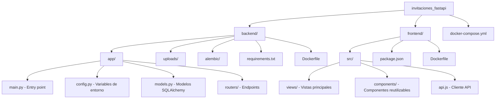

# Análisis del Proyecto: Invitaciones Digitales API

Este documento contiene un análisis detallado de la arquitectura, configuración y stack tecnológico del proyecto de **Invitaciones Digitales API**.

## 1. Visión General

**Descripción:** Aplicación web full-stack diseñada para la creación y gestión de invitaciones digitales. Incluye funcionalidades avanzadas de administración de eventos, sistema de confirmación de asistencia (RSVP) y sugerencias de canciones (playlist).

## 2. Stack Tecnológico

La aplicación está construida utilizando una arquitectura de cliente-servidor separada:

### Backend
- **Framework Principal:** FastAPI (Python 3.11)
- **Base de Datos:** MariaDB
- **ORM:** SQLAlchemy (modo asíncrono vía `aiomysql`)
- **Migraciones:** Alembic
- **Procesamiento de Imágenes:** Pillow (optimización y conversión automática a WebP)

### Frontend
- **Framework Principal:** Vue 3 (Composition API)
- **Herramienta de Build:** Vite
- **Enrutamiento:** Vue Router (v5)
- **Estilos e Iconos:** Font Awesome 6

### Infraestructura
- **Contenerización:** Docker & Docker Compose
- **Puertos de Red:** Backend (8000), Frontend (8081), MariaDB (3306)

---

## 3. Estructura de Directorios



---

## 4. Modelos de Datos Principales

El dominio de la aplicación se divide principalmente en los siguientes modelos:

1. **Template**: Define la estructura visual y base para un tipo de invitación (nombre, slug, descripción, preview).
2. **Cliente**: Entidad principal que almacena los datos de la invitación de un cliente particular.
   - *Básico:* Nombre, slug, información de contacto.
   - *Evento:* Fechas, horarios, ubicaciones de ceremonia y fiesta.
   - *Personalización:* Tipografías (`GoogleFontsChoices`), mensajes, dress code, instagram URL.
   - *Configuración Visual:* Flags booleanos para mostrar/ocultar secciones (ej. `mostrar_galeria`, `mostrar_playlist`).
   - *Imágenes:* Rutas a las imágenes subidas por el usuario (fondo y galería de hasta 9 fotos).
3. **ConfirmacionAsistencia (RSVP)**: Registros de los invitados que confirman su asistencia, indicando acompañantes y restricciones alimentarias.
4. **CancionPlaylist**: Sugerencias de canciones realizadas por los invitados.

---

## 5. Arquitectura de Endpoints (API REST)

### 🌍 Endpoints Públicos (Invitados)
- `GET /{tipo_evento}/{slug}`: Obtiene la información de la invitación pública.
- `POST /clientes/{id}/confirmaciones/`: Envía un nuevo RSVP.
- `POST /clientes/{id}/canciones/`: Añade una sugerencia a la playlist.

### 🔒 Endpoints de Administración
**Gestión de Clientes:**
- `GET /clientes/` y `GET /clientes/{id}`: Listado y detalle.
- `POST /clientes/` y `PUT /clientes/{id}`: Creación y edición.
- `POST /clientes/{id}/image`: Subida y procesamiento de imágenes asociadas a un cliente.

**Gestión de Templates:**
- `GET /templates/`, `POST /templates/`, `PUT /templates/{id}`, `DELETE /templates/{id}`

---

## 6. Funcionalidades Clave Implementadas

> [!TIP]
> **Procesamiento de Imágenes Automático**
> Al subir fotos a la galería de un cliente, el backend las redimensiona automáticamente (máx. 800px) y las convierte a formato WebP para optimizar el peso y los tiempos de carga de la invitación.

- **Tipos de Eventos Soportados:** Quinceañeras, Bodas, Cumpleaños, Fiestas Infantiles, entre otros.
- **Formularios Dinámicos:** Las invitaciones pueden mostrar u ocultar dinámicamente secciones como Ceremonia, Código de Vestimenta, Playlist o Lista de Regalos usando variables booleanas en la Base de Datos.
- **Tipografía Seleccionable:** Integración directa con fuentes de Google (Great Vibes, Dancing Script, etc.).

## 7. Comandos de Ejecución

### Entorno de Desarrollo (Docker)
Levanta todos los servicios (Frontend, Backend, Base de Datos):
```bash
docker-compose up --build
```

### Ejecución Manual (Local)
**Backend:**
```bash
cd backend
pip install -r requirements.txt
alembic upgrade head
uvicorn app.main:app --reload --host 0.0.0.0 --port 8000
```

**Frontend:**
```bash
cd frontend
npm install
npm run dev
```
